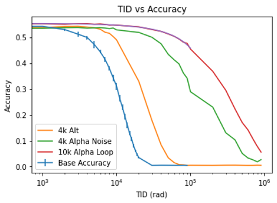

# Tiny ImageNet Training with CrossSim and Alpha-in-the-Loop

This repository explores methods for improving the robustness of deep learning models under **radiation-induced noise in in-situ analog computing hardware (SONOS)**.

When SONOS-based crossbar arrays are exposed to radiation, **total ionizing dose (TID)** effects cause conductance drift, which leads to errors in dot products and reduced model accuracy. To address this, we experiment with three approaches:

1. **Alpha Correction Factor (ACF)** – Apply a scalar correction to the dot product output to counteract drift.

   * Requires periodic calibration.
   * Reduces mean error across radiation levels.

2. **Noise-Aware Training** – Train neural networks with simulated TID noise injected into the forward/backward pass.

   * Models learn to adapt to noise distributions.
   * Variants include alternating TID levels or Gaussian-distributed TID.

3. **Alpha-in-the-Loop Training** – Combine both methods by training with noise **and** alpha correction applied during training.

   * Achieves the strongest robustness, maintaining accuracy even at high TID levels.

This specific folder contains the code for **Noise-Aware Training** and **Alpha-in-the-Loop Training**. Refer to  for the implementation of the alpha correction factor upon a single layer.

Experiments are performed on **Tiny ImageNet** using a **ResNet-32 backbone** (with an additional 256×256 linear layer intended for SONOS hardware programming). Results show that combining alpha correction and noise-aware training improves resilience by an **order of magnitude** in terms of tolerable TID before accuracy degradation.

---

## 📂 Repository Structure

* **`build_tiny_imagenet.py`** – Builds a ResNet32 architecture tailored for Tiny ImageNet.
* **`data_loader_tiny_imagenet.py`** – Prepares and loads data from the `TIN_dataset` folder.
* **`train_tiny_imagenet.py`** – Baseline training script (no CrossSim).
* **`train_TIN_noise.py`** – Training with CrossSim noise injection.
* **`train_TIN_alpha.py`** – Training with both CrossSim noise and alpha-in-the-loop correction (can also run in noise-only mode with `use_alpha=False`).
* **`inference_tiny_imagenet.py`** – Standard inference on trained models.
* **`full_network_alpha.py`** – Inference with alpha correction (can also replicate baseline inference if `use_alpha=False`).
* **`model_weights.py`** – Extracts and saves the penultimate linear layer of a model (layer used on physical SONOS board).
* **`TID_data_0802_CrossSim.p` / `TID_params_202312.p`** – SONOS experiment data used in simulations.

### Folders

* **`TIN_dataset/`** – Python code that processes Tiny Imagenet data.

---

## ⚙️ Setup

1. Download the PyTorch branch of this repository.
2. Refer to the repository  for necessary packages.
3. Download the Tiny ImageNet dataset to "applications/dnn/data".
4. Process the Tiny ImageNet dataset.

 ```bash
  python TIN_dataset/TIN_DataSet_Parser.py
  ```
---

## 🚀 Usage

### Training

* Baseline:

  ```bash
  python train_tiny_imagenet.py
  ```
* With CrossSim noise:

  ```bash
  python train_TIN_noise.py
  ```
* With alpha-in-the-loop:

  ```bash
  python train_TIN_alpha.py
  ```

### Inference

* Standard:

  ```bash
  python inference_tiny_imagenet.py --model_path model.pth
  ```
* With alpha correction:

  ```bash
  python full_network_alpha.py --model_path model.pth --use_alpha True
  ```

### Extract Model Weights for Deployment onto SONOS board

```bash
python model_weights.py --model_path alpha_loop_models/model.pth --output weights.pth
```

---

## 📊 Results



| Training Type           | Inference Trials | 0 TID Accuracy | Peak Accuracy   | Loses 5% Accuracy (TID) | Reaches 49.335% Accuracy (TID) |
|-------------------------|------------------|----------------|-----------------|--------------------------|--------------------------------|
| Base                    | 10               | 54.335         | 54.335 (0k)     | 4.174k                   | 4.174k                         |
| 4k (Alternating)        | 3                | 54.64          | 54.64 (0k)      | 9.684k                   | 9.944k                         |
| 4e3 Alpha Noise         | 3                | 53.68          | 53.7 (3k)       | 33.95k                   | 31.23k                         |
| 10k Alpha in the Loop   | 10               | 55.2           | 55.2 (4k)       | 57.3k                    | 70.3k                          |

Trained models available upon request (tbenjam4@asu.edu)

Comparison of accuracy, robustness, and error patterns across training modes shows that **alpha-in-the-loop consistently yields the best performance under radiation noise**.

Refer  for more data/background information.

---

## 👥 Contributors

* [Benjamin Tung](https://github.com/bentung12)
* Patrick Xiao and Matthew Marinella for mentorship
* Maximillian Siath for gathering SONOS TID data
* Justin Weidmann, Zachary White, Wataru Tamaki, Hoyeol Bae for SONOS experimental testing
